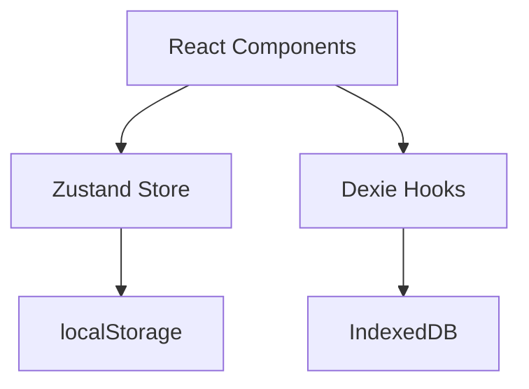

Kayston's Forge uses **Zustand** for client-side state management with automatic persistence to **localStorage**.

## Architecture Overview

### State Layer Separation

1. **UI State** (Zustand + localStorage) — Sidebar, active tool, settings
2. **Persistent Data** (Dexie + IndexedDB) — History, favorites



<Note>
Zustand is used for lightweight UI state that needs to persist across sessions. IndexedDB (via Dexie) handles larger structured data like history entries.
</Note>

## Zustand Store (`lib/store.ts`)

### Store Definition

```typescript
import { create } from 'zustand';
import { persist } from 'zustand/middleware';
import type { AppSettings } from '@/types';

type State = {
  sidebarOpen: boolean;
  activeToolId: string;
  commandPaletteOpen: boolean;
  settings: AppSettings;
  setActiveTool: (id: string) => void;
  toggleSidebar: () => void;
  setCommandPaletteOpen: (open: boolean) => void;
  updateSettings: (partial: Partial<AppSettings>) => void;
};
```

### Persistence Middleware

The store automatically syncs to localStorage:

```typescript
export const useAppStore = create<State>()()
  persist(
    (set) => ({
      sidebarOpen: true,
      activeToolId: 'json-format-validate',
      commandPaletteOpen: false,
      settings: defaults,
      setActiveTool: (id) => set({ activeToolId: id }),
      toggleSidebar: () => set((s) => ({ sidebarOpen: !s.sidebarOpen })),
      setCommandPaletteOpen: (open) => set({ commandPaletteOpen: open }),
      updateSettings: (partial) => set((s) => ({ settings: { ...s.settings, ...partial } })),
    }),
    { name: 'kaystons-forge-ui' }, // localStorage key
  ),
);
```

**localStorage key**: `kaystons-forge-ui`

### Default State

```typescript
const defaults: AppSettings = {
  theme: 'light',
  editorFontSize: 14,
  editorTabSize: 2,
  autoFormatOnPaste: false,
  preserveHistory: true,
};
```

## State Properties

### `sidebarOpen: boolean`

Controls sidebar visibility (desktop only).

**Default**: `true`

**Usage**:
```tsx
const { sidebarOpen, toggleSidebar } = useAppStore();

<button onClick={toggleSidebar}>
  {sidebarOpen ? 'Hide' : 'Show'} Sidebar
</button>
```

**Keyboard shortcut**: `Cmd/Ctrl + 1`

### `activeToolId: string`

Tracks the currently active tool for UI state (e.g., command palette selection).

**Default**: `'json-format-validate'`

**Usage**:
```tsx
const { activeToolId, setActiveTool } = useAppStore();

useEffect(() => {
  setActiveTool(toolId);
}, [toolId]);
```

<Note>
The `activeToolId` in the store may differ from the URL path during navigation. Always use the URL as the source of truth for routing.
</Note>

### `commandPaletteOpen: boolean`

Controls command palette modal visibility.

**Default**: `false`

**Usage**:
```tsx
const { commandPaletteOpen, setCommandPaletteOpen } = useAppStore();

useEffect(() => {
  const onKey = (e: KeyboardEvent) => {
    if ((e.metaKey || e.ctrlKey) && e.key === 'k') {
      e.preventDefault();
      setCommandPaletteOpen(true);
    }
  };
  window.addEventListener('keydown', onKey);
  return () => window.removeEventListener('keydown', onKey);
}, [setCommandPaletteOpen]);
```

**Keyboard shortcut**: `Cmd/Ctrl + K`

### `settings: AppSettings`

Application-wide settings object.

```typescript
export interface AppSettings {
  theme: 'dark' | 'light' | 'system';
  editorFontSize: number;      // 10–24 px
  editorTabSize: number;       // 2 or 4 spaces
  autoFormatOnPaste: boolean;  // Auto-run tool on paste
  preserveHistory: boolean;    // Save to IndexedDB
}
```

**Usage**:
```tsx
const { settings, updateSettings } = useAppStore();

<input
  type="number"
  value={settings.editorFontSize}
  onChange={(e) => updateSettings({ editorFontSize: Number(e.target.value) })}
/>
```

<Warning>
The `theme` setting exists in the type definition but the UI toggle is not implemented. The app always renders in Solarized Light theme.
</Warning>

## Store Actions

### `setActiveTool(id: string)`

Updates the active tool ID.

```typescript
const { setActiveTool } = useAppStore();

const handleToolSelect = (toolId: string) => {
  setActiveTool(toolId);
  router.push(`/tools/${toolId}`);
};
```

### `toggleSidebar()`

Toggles sidebar visibility.

```typescript
const { toggleSidebar } = useAppStore();

<button onClick={toggleSidebar} aria-label="Toggle sidebar">
  <Bars3Icon />
</button>
```

### `setCommandPaletteOpen(open: boolean)`

Opens or closes the command palette.

```typescript
const { setCommandPaletteOpen } = useAppStore();

setCommandPaletteOpen(true);  // Open
setCommandPaletteOpen(false); // Close
```

### `updateSettings(partial: Partial<AppSettings>)`

Merges partial settings into the current settings object.

```typescript
const { updateSettings } = useAppStore();

updateSettings({
  editorFontSize: 16,
  autoFormatOnPaste: true,
});
```

## localStorage Schema

The store is serialized to localStorage with the following structure:

**Key**: `kaystons-forge-ui`

**Value** (JSON):
```json
{
  "state": {
    "sidebarOpen": true,
    "activeToolId": "json-format-validate",
    "commandPaletteOpen": false,
    "settings": {
      "theme": "light",
      "editorFontSize": 14,
      "editorTabSize": 2,
      "autoFormatOnPaste": false,
      "preserveHistory": true
    }
  },
  "version": 0
}
```

### Manual Inspection

Open browser DevTools → Application → Local Storage → `https://forge.kayston.com`

```javascript
// Read store
JSON.parse(localStorage.getItem('kaystons-forge-ui'))

// Clear store (reset to defaults)
localStorage.removeItem('kaystons-forge-ui')
window.location.reload()
```

## Migration from Previous Version

The app includes a migration script for the old localStorage key:

```typescript
// lib/store.ts
if (typeof window !== 'undefined') {
  const old = localStorage.getItem('adlers-forge-ui');
  if (old && !localStorage.getItem('kaystons-forge-ui')) {
    localStorage.setItem('kaystons-forge-ui', old);
    localStorage.removeItem('adlers-forge-ui');
  }
}
```

This automatically migrates data from `adlers-forge-ui` → `kaystons-forge-ui` on first load.

## Usage Patterns

### Reading State

```tsx
import { useAppStore } from '@/lib/store';

export function Sidebar() {
  const sidebarOpen = useAppStore((state) => state.sidebarOpen);
  
  if (!sidebarOpen) return null;
  return <aside>...</aside>;
}
```

<Note>
Use selector functions to avoid unnecessary re-renders. Only subscribe to the specific state slice you need.
</Note>

### Updating State

```tsx
import { useAppStore } from '@/lib/store';

export function ToolNav() {
  const setActiveTool = useAppStore((state) => state.setActiveTool);
  
  return (
    <button onClick={() => setActiveTool('jwt-debugger')}>
      JWT Debugger
    </button>
  );
}
```

### Multiple State Slices

```tsx
import { useAppStore } from '@/lib/store';

export function Header() {
  const { sidebarOpen, toggleSidebar, setCommandPaletteOpen } = useAppStore();
  
  return (
    <header>
      <button onClick={toggleSidebar}>
        {sidebarOpen ? 'Hide' : 'Show'}
      </button>
      <button onClick={() => setCommandPaletteOpen(true)}>
        Search
      </button>
    </header>
  );
}
```

## Performance

### Zustand Benefits

1. **Minimal re-renders** — Only subscribed components update
2. **No context nesting** — Direct hook access
3. **Automatic persistence** — localStorage sync via middleware
4. **TypeScript-first** — Full type safety

### Re-render Optimization

**Bad** (subscribes to entire store):
```tsx
const store = useAppStore(); // Re-renders on any state change
```

**Good** (subscribes to specific property):
```tsx
const sidebarOpen = useAppStore((state) => state.sidebarOpen);
```

### localStorage Performance

Zustand's persist middleware batches writes:
- Debounced to prevent excessive writes
- JSON serialization/deserialization on load/save
- ~1 KB storage footprint

## Testing

Mock the store in tests:

```typescript
import { useAppStore } from '@/lib/store';

// Mock Zustand store
vi.mock('@/lib/store', () => ({
  useAppStore: vi.fn(() => ({
    sidebarOpen: true,
    activeToolId: 'json-format-validate',
    toggleSidebar: vi.fn(),
    setActiveTool: vi.fn(),
  })),
}));

test('renders with sidebar open', () => {
  render(<Sidebar />);
  expect(screen.getByRole('complementary')).toBeInTheDocument();
});
```

## Future Enhancements

### Theme Switcher

Implement UI toggle for dark/light/system themes:

```tsx
const { settings, updateSettings } = useAppStore();

<select
  value={settings.theme}
  onChange={(e) => updateSettings({ theme: e.target.value as 'dark' | 'light' | 'system' })}
>
  <option value="light">Light</option>
  <option value="dark">Dark</option>
  <option value="system">System</option>
</select>
```

### Per-Tool Settings

Store tool-specific preferences:

```typescript
type ToolSettings = Record<string, Record<string, unknown>>;

interface State {
  toolSettings: ToolSettings;
  updateToolSettings: (toolId: string, settings: Record<string, unknown>) => void;
}
```

### Undo/Redo

Implement history stack for input/output:

```typescript
interface State {
  history: Array<{ input: string; output: string }>;
  historyIndex: number;
  undo: () => void;
  redo: () => void;
}
```