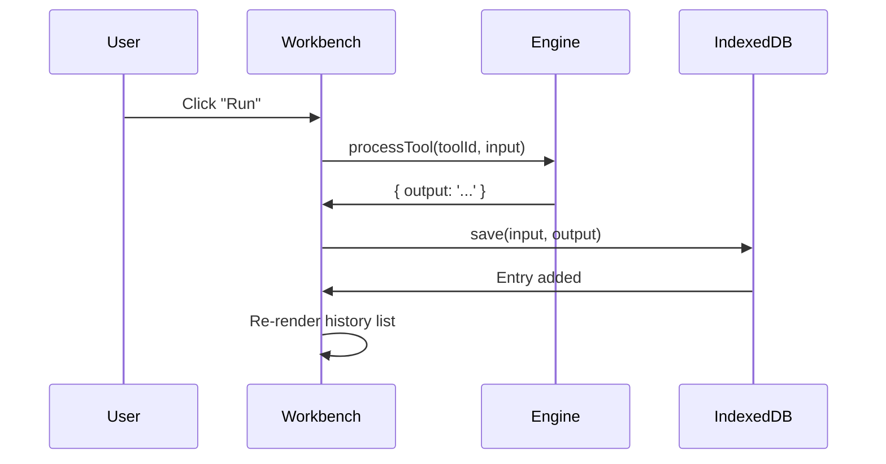

Kayston's Forge uses **Dexie.js** (a wrapper around IndexedDB) for client-side persistent storage of history, favorites, and settings.

## Why IndexedDB?

- **Large storage capacity** — Up to 50% of disk space (vs. 5–10 MB for localStorage)
- **Structured data** — Store objects, not just strings
- **Indexed queries** — Fast lookups by tool ID, timestamp, etc.
- **Async API** — Non-blocking reads/writes

<Note>
IndexedDB is persistent across sessions and survives browser restarts. Data is scoped per origin (https://forge.kayston.com).
</Note>

## Database Schema (`lib/db.ts`)

### Database Definition

```typescript
import Dexie, { Table } from 'dexie';
import type { HistoryEntry } from '@/types';

export class KaystonsForgeDB extends Dexie {
  history!: Table<HistoryEntry, number>;
  favorites!: Table<{ id?: number; toolId: string }, number>;
  settings!: Table<{ id: string; value: unknown }, string>;

  constructor() {
    super('KaystonsForgeDB');
    this.version(1).stores({
      history: '++id, toolId, timestamp, starred',
      favorites: '++id, toolId',
      settings: 'id',
    });
  }
}

export const db = new KaystonsForgeDB();
```

**Database name**: `KaystonsForgeDB`

**Version**: 1

### Tables

#### `history`

Stores input/output history per tool.

**Schema**:
```typescript
interface HistoryEntry {
  id?: number;        // Auto-incrementing primary key
  toolId: string;     // Tool identifier (e.g., 'json-format-validate')
  timestamp: number;  // Unix milliseconds
  input: string;      // User input
  output: string;     // Tool output
  starred: boolean;   // Favorite flag
}
```

**Indexes**:
- `++id` — Auto-increment primary key
- `toolId` — Index for filtering by tool
- `timestamp` — Index for sorting by date
- `starred` — Index for filtering favorites

**Max entries per tool**: 50 (oldest auto-deleted)

#### `favorites`

Stores user-favorited tools (not currently used in UI).

**Schema**:
```typescript
interface Favorite {
  id?: number;     // Auto-incrementing primary key
  toolId: string;  // Tool identifier
}
```

**Indexes**:
- `++id` — Auto-increment primary key
- `toolId` — Index for lookups

#### `settings`

Stores misc settings (not currently used; Zustand/localStorage used instead).

**Schema**:
```typescript
interface Setting {
  id: string;        // Setting key
  value: unknown;    // Setting value (any JSON-serializable)
}
```

**Indexes**:
- `id` — Primary key (setting name)

## History Hook (`hooks/useHistory.ts`)

The `useHistory` hook provides a reactive API for reading/writing history.

### Hook Definition

```typescript
import { useLiveQuery } from 'dexie-react-hooks';
import { db } from '@/lib/db';
import type { HistoryEntry } from '@/types';

export function useHistory(toolId: string) {
  // Reactive query: auto-updates when DB changes
  const entries = useLiveQuery(
    () => db.history
      .where('toolId').equals(toolId)
      .reverse()            // Newest first
      .limit(50)
      .toArray(),
    [toolId]
  ) ?? [];

  const save = async (input: string, output: string) => {
    await db.history.add({
      toolId,
      input,
      output,
      timestamp: Date.now(),
      starred: false,
    });
    
    // Enforce max 50 entries per tool
    const all = await db.history
      .where('toolId').equals(toolId)
      .sortBy('timestamp');
    
    if (all.length > 50) {
      const toDelete = all.slice(0, all.length - 50);
      await db.history.bulkDelete(toDelete.map((e) => e.id!));
    }
  };

  const clear = async () => {
    await db.history.where('toolId').equals(toolId).delete();
  };

  return { entries, save, clear };
}
```

### Usage in Components

```tsx
import { useHistory } from '@/hooks/useHistory';

export function ToolWorkbench({ toolId }: { toolId: string }) {
  const { entries, save, clear } = useHistory(toolId);
  
  const runTool = async () => {
    const result = await processTool(toolId, input);
    setOutput(result.output);
    await save(input, result.output); // Persist to IndexedDB
  };
  
  return (
    <div>
      <button onClick={runTool}>Run</button>
      <button onClick={clear}>Clear History</button>
      
      <ul>
        {entries.map((entry) => (
          <li key={entry.id}>
            {new Date(entry.timestamp).toLocaleString()}
            <pre>{entry.input}</pre>
          </li>
        ))}
      </ul>
    </div>
  );
}
```

<Note>
The `useLiveQuery` hook from `dexie-react-hooks` automatically re-renders the component when the query result changes (e.g., after adding/deleting entries).
</Note>

## History Lifecycle

### 1. User Runs Tool



### 2. History Entry Saved

```typescript
await db.history.add({
  toolId: 'json-format-validate',
  input: '{"a":1}',
  output: '{\n  "a": 1\n}',
  timestamp: 1678901234567,
  starred: false,
});
```

### 3. Enforce Max 50 Entries

Oldest entries are deleted:

```typescript
const all = await db.history
  .where('toolId').equals('json-format-validate')
  .sortBy('timestamp');

if (all.length > 50) {
  const toDelete = all.slice(0, all.length - 50);
  await db.history.bulkDelete(toDelete.map((e) => e.id!));
}
```

### 4. History List Auto-Updates

`useLiveQuery` triggers re-render when history changes:

```tsx
const entries = useLiveQuery(
  () => db.history.where('toolId').equals(toolId).reverse().limit(50).toArray(),
  [toolId]
) ?? [];

{entries.map((entry) => <HistoryItem key={entry.id} entry={entry} />)}
```

## Querying IndexedDB

### Get All History for a Tool

```typescript
const entries = await db.history
  .where('toolId')
  .equals('json-format-validate')
  .toArray();
```

### Get Most Recent Entry

```typescript
const latest = await db.history
  .where('toolId')
  .equals('json-format-validate')
  .reverse()
  .first();
```

### Get Starred Entries

```typescript
const starred = await db.history
  .where('starred')
  .equals(1)  // 1 = true in Dexie
  .toArray();
```

### Search History by Input

```typescript
const matches = await db.history
  .where('toolId')
  .equals('json-format-validate')
  .filter((entry) => entry.input.includes('search term'))
  .toArray();
```

### Delete Entry by ID

```typescript
await db.history.delete(123);
```

### Clear All History for Tool

```typescript
await db.history
  .where('toolId')
  .equals('json-format-validate')
  .delete();
```

## Migration from Old Database

The app includes a migration script for the old database name:

```typescript
// lib/db.ts
if (typeof window !== 'undefined') {
  (async () => {
    try {
      const names = await Dexie.getDatabaseNames();
      if (names.includes('AdlersForgeDB')) {
        const oldDb = new Dexie('AdlersForgeDB');
        oldDb.version(1).stores({
          history: '++id, toolId, timestamp, starred',
          favorites: '++id, toolId',
          settings: 'id'
        });
        
        const oldHistory = await oldDb.table('history').toArray();
        if (oldHistory.length > 0) {
          await db.history.bulkAdd(
            oldHistory.map(({ id, ...rest }) => rest as HistoryEntry)
          );
        }
        
        await oldDb.delete();
      }
    } catch { /* migration optional */ }
  })();
}
```

This automatically migrates data from `AdlersForgeDB` → `KaystonsForgeDB` on first load.

## Manual Inspection

Inspect IndexedDB in Chrome DevTools:

1. Open DevTools → **Application** tab
2. Expand **IndexedDB** → **KaystonsForgeDB**
3. Click **history** table
4. View all entries in table view

### Manual Queries (Console)

```javascript
// Import db (if available in global scope)
const db = window.db;

// Get all history
await db.history.toArray();

// Get history for specific tool
await db.history.where('toolId').equals('json-format-validate').toArray();

// Clear all history
await db.history.clear();

// Delete entire database
await db.delete();
```

## Storage Limits

### Quota Management

IndexedDB quota is shared across all storage APIs (localStorage, Cache API, etc.).

**Check quota**:
```javascript
const estimate = await navigator.storage.estimate();
console.log(`Used: ${estimate.usage} bytes`);
console.log(`Quota: ${estimate.quota} bytes`);
console.log(`Percentage: ${(estimate.usage / estimate.quota * 100).toFixed(2)}%`);
```

**Typical limits**:
- Desktop Chrome: ~60% of disk space
- Mobile Chrome: ~10% of disk space
- Safari: ~1 GB

### Handling Quota Errors

```typescript
try {
  await db.history.add(entry);
} catch (error) {
  if (error.name === 'QuotaExceededError') {
    // Delete old entries and retry
    await db.history.orderBy('timestamp').limit(100).delete();
    await db.history.add(entry);
  }
}
```

## Performance

### Query Performance

- **Indexed queries**: O(log n) — Use `where()` on indexed fields
- **Full table scans**: O(n) — Avoid `filter()` on large tables
- **Bulk operations**: Use `bulkAdd()`, `bulkPut()`, `bulkDelete()`

### Batch Writes

**Slow** (individual writes):
```typescript
for (const entry of entries) {
  await db.history.add(entry);
}
```

**Fast** (batch write):
```typescript
await db.history.bulkAdd(entries);
```

### Read Performance

With 50 entries per tool × 47 tools = ~2,350 max entries:
- **Cold read**: ~5–10 ms
- **Hot read**: ~1–2 ms (cached in memory)

## Privacy & Security

### Data Scope

IndexedDB data is scoped per origin:
- **Origin**: `https://forge.kayston.com`
- **Isolation**: Data not accessible from other origins
- **Private browsing**: Data cleared when session ends

### User Data

History contains potentially sensitive user input:
- API keys
- JWT tokens
- Personal data

<Warning>
Do NOT sync IndexedDB data to cloud storage or analytics. All data must remain local per the privacy-first design.
</Warning>

### Clearing Data

Users can clear history per tool or delete the entire database:

```typescript
// Clear tool history
await db.history.where('toolId').equals('json-format-validate').delete();

// Delete entire database
await db.delete();
```

## Future Enhancements

### Export/Import History

Allow users to export history as JSON:

```typescript
const exportHistory = async () => {
  const all = await db.history.toArray();
  const json = JSON.stringify(all, null, 2);
  const blob = new Blob([json], { type: 'application/json' });
  const url = URL.createObjectURL(blob);
  const a = document.createElement('a');
  a.href = url;
  a.download = 'forge-history.json';
  a.click();
};
```

### Favorites System

Implement UI for favoriting tools:

```typescript
const toggleFavorite = async (toolId: string) => {
  const existing = await db.favorites.where('toolId').equals(toolId).first();
  if (existing) {
    await db.favorites.delete(existing.id!);
  } else {
    await db.favorites.add({ toolId });
  }
};
```

### Full-Text Search

Add search across all history:

```typescript
const search = async (query: string) => {
  return db.history
    .filter((entry) =>
      entry.input.toLowerCase().includes(query.toLowerCase()) ||
      entry.output.toLowerCase().includes(query.toLowerCase())
    )
    .toArray();
};
```