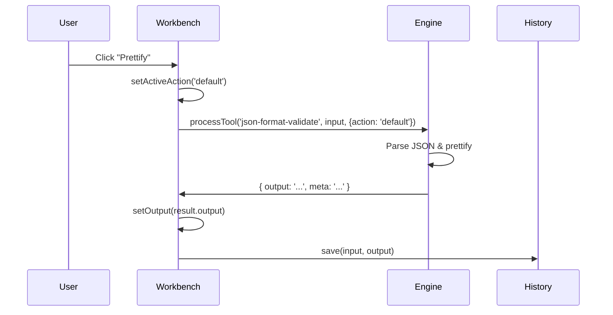

The entire tool system is driven by a three-file architecture pattern:

1. **Registry** — Define tool metadata
2. **Engine** — Process tool logic
3. **Workbench** — Render unified UI

<Note>
This pattern allows adding new tools by making changes to only three files: `registry.ts`, `engine.ts`, and optionally `ToolWorkbench.tsx` for action buttons.
</Note>

## Registry (`lib/tools/registry.ts`)

### Purpose

The registry is the **single source of truth** for all tools in the application. It exports:

- `tools` — Array of 47 tool definitions
- `toolMap` — Map for O(1) tool lookup by ID
- `defaultToolId` — Default tool on app load
- `categoryLabels` — Human-readable category names

### Tool Definition Schema

```typescript
export interface ToolDefinition {
  id: string;                    // URL-safe identifier
  name: string;                  // Display name
  description: string;           // Subtitle
  category: ToolCategory;        // Grouping for sidebar
  icon: ComponentType;           // Heroicon component
  keywords: string[];            // Search terms
}
```

### Categories

```typescript
export const categoryLabels = {
  encoding: 'Encoding & Encryption',
  escaping: 'Escaping & Entities',
  preview: 'Preview & Comparison',
  format: 'Format Converters',
  beautify: 'Code Beautifiers',
  generator: 'Generators',
  data: 'Data Transformers',
} as const;
```

### Example Tool Entry

```typescript
{
  id: 'json-format-validate',
  name: 'JSON Format/Validate',
  description: 'Validate and format JSON',
  category: 'encoding',
  icon: CodeBracketIcon,
  keywords: ['json', 'validate', 'prettify']
}
```

### Static Route Generation

The registry powers `generateStaticParams()` in Next.js:

```typescript
// app/tools/[toolId]/page.tsx
import { tools } from '@/lib/tools/registry';

export async function generateStaticParams() {
  return tools.map((tool) => ({ toolId: tool.id }));
}
```

This generates 47 static pages at build time:
- `/tools/json-format-validate`
- `/tools/base64-string`
- `/tools/jwt-debugger`
- ...and 44 more

## Engine (`lib/tools/engine.ts`)

### Purpose

The engine is a **synchronous function** that processes tool logic:

```typescript
export async function processTool(
  toolId: string,
  input: string,
  options: ProcessOptions = {}
): Promise<ProcessResult>
```

<Note>
Despite the `async` signature, most tools run synchronously on the main thread. The `async` keyword allows dynamic imports for heavy libraries (e.g., `jwt-decode`, `terser`).
</Note>

### Input/Output Types

```typescript
export interface ProcessOptions {
  action?: string;        // Action button ID (e.g., 'minify', 'decode')
  secondInput?: string;   // Secondary textarea (e.g., regex pattern)
  dedupe?: boolean;       // Line sort deduplication
  pattern?: string;       // Regex pattern
  flags?: string;         // Regex flags
  [key: string]: unknown; // Tool-specific options
}

export interface ProcessResult {
  output: string;         // Main text output
  previewHtml?: string;   // HTML preview (sanitized)
  previewDataUrl?: string;// Base64 image preview
  table?: Array<Record<string, string>>; // Tabular data
  meta?: string;          // Status/info message
}
```

### Switch Statement Architecture

The engine uses a **large switch statement** to route tool IDs:

```typescript
switch (toolId) {
  case 'json-format-validate': {
    const parsed = parseJsonLoose(input);
    if (action === 'minify') return { output: stringify(parsed, false) };
    if (action === 'js-object') return { output: `const data = ${stringify(parsed, true)};` };
    return { output: stringify(parsed, true) };
  }

  case 'base64-string': {
    if (action === 'decode') {
      const normalized = input.trim().replaceAll('-', '+').replaceAll('_', '/');
      const padded = normalized + '='.repeat((4 - (normalized.length % 4)) % 4);
      return { output: decodeURIComponent(escape(atob(padded))) };
    }
    const encoded = btoa(unescape(encodeURIComponent(input)));
    return { output: action === 'encode-url-safe' ? encoded.replaceAll('+', '-').replaceAll('/', '_').replaceAll(/=+$/g, '') : encoded };
  }

  case 'jwt-debugger': {
    const [headSegment, payloadSegment] = input.trim().split('.');
    const { jwtDecode } = await import('jwt-decode');
    const payload = jwtDecode<Record<string, unknown>>(token);
    // ... decode and format
    return { output: `// Header\n${stringify(header)}\n\n// Payload\n${stringify(payload)}` };
  }

  // ... 44 more cases
}
```

### Auxiliary Tool Modules

Complex tools are extracted to separate modules:

- `lib/tools/php-tools.ts` — PHP serialize/unserialize, array syntax parser
- `lib/tools/curl-to-code.ts` — cURL → JavaScript/Python/PHP
- `lib/tools/json-to-code.ts` — JSON → TypeScript/Python/Go/Rust
- `lib/tools/cert-decoder.ts` — X.509 certificate parser (pure JS ASN.1 DER)
- `lib/tools/list-compare.ts` — List intersection/union/diff with fuzzy matching
- `lib/tools/csv-to-sql.ts` — CSV → SQL INSERT with multiline field support

Example import:

```typescript
import { phpUnserialize, phpSerialize } from './php-tools';

case 'php-to-json': {
  const parsed = phpUnserialize(input);
  return { output: stringify(parsed, true) };
}
```

### Input Size Guards

To prevent UI freezing, the engine rejects large inputs:

```typescript
const MAX_INPUT_BYTES = 5 * 1024 * 1024; // 5 MB
if (input.length > MAX_INPUT_BYTES || (options.secondInput ?? '').length > MAX_INPUT_BYTES) {
  return { output: 'Input too large (max 5 MB). Paste a smaller sample.' };
}
```

## Workbench (`components/tools/ToolWorkbench.tsx`)

### Purpose

The workbench is a **unified UI component** used by all 51 tools. It handles:

- Input/output textareas
- Action buttons (Beautify/Minify/Decode/etc.)
- Preview panes (HTML/Markdown/Images)
- History sidebar
- Keyboard shortcuts
- Copy/download functionality

### Action Configuration

Action buttons are mapped per tool ID:

```typescript
const actionConfig: Record<string, Action[]> = {
  'json-format-validate': [
    { id: 'default', label: 'Prettify' },
    { id: 'minify', label: 'Minify' },
    { id: 'js-object', label: 'To JS Object' },
  ],
  'base64-string': [
    { id: 'default', label: 'Encode' },
    { id: 'decode', label: 'Decode' },
    { id: 'encode-url-safe', label: 'URL-safe' },
  ],
  'html-beautify': [
    { id: 'default', label: 'Beautify' },
    { id: 'minify', label: 'Minify' },
  ],
  // ... 47 tool entries
};
```

Action IDs are passed to `processTool()` via the `action` option.

### Rendering Action Buttons

```tsx
const actions = useMemo(
  () => actionConfig[toolId] ?? [{ id: 'default', label: 'Run' }],
  [toolId]
);

{actions.map((action) => (
  <button
    key={action.id}
    onClick={() => {
      setActiveAction(action.id);
      void run(action.id);
    }}
    className={activeAction === action.id ? 'active' : ''}
  >
    {action.label}
  </button>
))}
```

### Tool Execution Flow



### Syntax Highlighting

Output syntax highlighting uses Prism.js with dynamic imports:

```typescript
const highlightLang: Record<string, string> = {
  'json-format-validate': 'json',
  'sql-formatter': 'sql',
  'html-to-jsx': 'jsx',
  // ...
};

useEffect(() => {
  if (!lang || !output) return;
  (async () => {
    const Prism = (await import('prismjs')).default;
    await import(`prismjs/components/prism-${lang}`);
    const highlighted = Prism.highlight(output, Prism.languages[lang], lang);
    setHighlightedHtml(highlighted);
  })();
}, [lang, output]);
```

### Tool-Specific UI Elements

#### Secondary Input

Some tools require a second textarea:

```typescript
const needsSecondInput = new Set([
  'regexp-tester',  // Pattern to test
  'text-diff',      // Right-hand side
  'hash-generator', // HMAC secret key
  'list-compare',   // List B
]);

{needsSecondInput.has(toolId) && (
  <textarea
    placeholder="Secondary input"
    value={secondInput}
    onChange={(e) => setSecondInput(e.target.value)}
  />
)}
```

#### Preview Panes

HTML/Markdown previews render in a sandboxed iframe:

```typescript
const needsPreview = new Set(['html-preview', 'markdown-preview', 'base64-image']);

{needsPreview.has(toolId) && previewHtml && (
  <iframe
    title="Preview"
    sandbox=""  // No scripts, forms, or popups
    srcDoc={previewHtml}
  />
)}
```

#### QR Code Upload

QR decoder accepts image uploads:

```typescript
{toolId === 'qr-code' && (
  <input
    type="file"
    accept="image/*"
    onChange={async (e) => {
      const file = e.target.files?.[0];
      if (file) await decodeQrFromFile(file);
    }}
  />
)}
```

### Keyboard Shortcuts

```typescript
useEffect(() => {
  const onKey = (e: KeyboardEvent) => {
    const cmd = e.metaKey || e.ctrlKey;
    if (cmd && e.key === 'Enter') void run();             // Execute
    if (cmd && e.shiftKey && e.key === 'c') void copy(output);  // Copy
    if (cmd && e.shiftKey && e.key === 's') downloadOutput();   // Save
    if (e.key === 'Escape') clearInputs();                // Clear
  };
  window.addEventListener('keydown', onKey);
  return () => window.removeEventListener('keydown', onKey);
}, [output]);
```

## Adding a New Tool

To add a new tool to Kayston's Forge:

### 1. Add to Registry

```typescript
// lib/tools/registry.ts
{
  id: 'my-new-tool',
  name: 'My New Tool',
  description: 'Short description',
  category: 'data',
  icon: SparklesIcon,
  keywords: ['keyword1', 'keyword2']
}
```

### 2. Add to Engine

```typescript
// lib/tools/engine.ts
case 'my-new-tool': {
  // Process input
  const result = processMyTool(input, action);
  return { output: result };
}
```

### 3. (Optional) Add Actions

```typescript
// components/tools/ToolWorkbench.tsx
const actionConfig: Record<string, Action[]> = {
  'my-new-tool': [
    { id: 'default', label: 'Run' },
    { id: 'advanced', label: 'Advanced' },
  ],
  // ...
};
```

### 4. Build & Test

```bash
npm run build  # Generates static page at /tools/my-new-tool
npm run dev    # Test in development
```

<Warning>
All tools run synchronously on the main thread. Heavy processing (>100ms) will freeze the UI. Consider using Web Workers for CPU-intensive tasks.
</Warning>

## Testing

Tools are tested with Vitest:

```typescript
// tests/unit/engine.test.ts
test('json-format-validate prettifies JSON', async () => {
  const result = await processTool('json-format-validate', '{"a":1}', { action: 'default' });
  expect(result.output).toContain('"a": 1');
});
```

**Test coverage**: 157 tests across 3 files
- `engine.test.ts` — 57 tests (all tool IDs)
- `bugfixes.test.ts` — 28 regression tests
- `fuzz.test.ts` — 72 parser robustness tests

## Performance Considerations

### Bundle Size

- **Current**: ~513 kB (all tools load on every page)
- **Optimization**: Use dynamic imports per tool

```typescript
// Future optimization
case 'sql-formatter': {
  const { format } = await import('sql-formatter');
  return { output: format(input) };
}
```

### Synchronous Processing

All tools run on the main thread:
- **Pros**: Simple, no message passing overhead
- **Cons**: Large inputs can freeze UI

<Note>
Input is limited to 5 MB to prevent freezing. For production use with large files, consider Web Workers or streaming processing.
</Note>